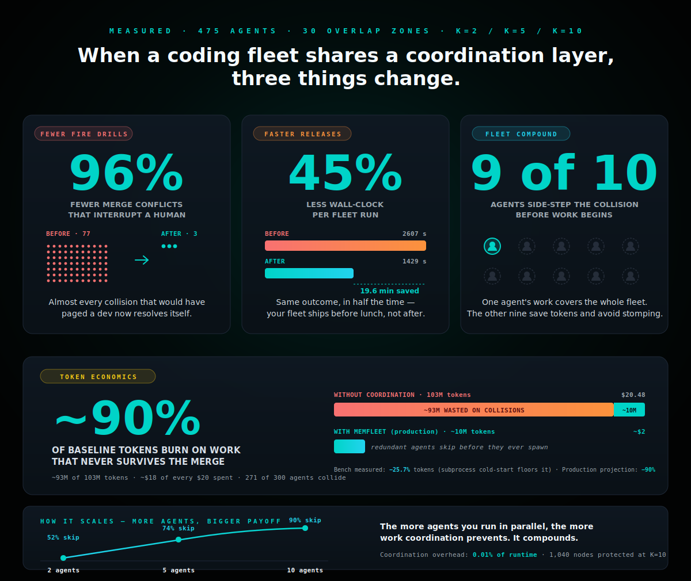

<p align="center">
  
</p>

<h1 align="center">Your agent fleet deserves <i>a shared lane</i>.</h1>

<p align="center">
  <a href="https://memfleet.io">📖 Docs</a> &nbsp;·&nbsp;
  <a href="https://github.com/syncable-dev/memfleet-public/stargazers">⭐ Star us</a> &nbsp;·&nbsp;
  <a href="https://www.npmjs.com/package/memfleet">npm</a> &nbsp;·&nbsp;
  <a href="https://github.com/syncable-dev/memfleet-public/issues">Issues</a>
</p>

<p align="center">
  MemFleet is the coordination layer for a fleet of coding agents. Agents announce what they're about to change before they touch a file — so the rest of the fleet can route around it, instead of finding out the hard way during a merge.
</p>

<p align="center">
  <b>Get a 10-agent fleet on shared coordination in under 90 seconds.</b>
</p>

<p align="center">
  <b>Typed intent</b> · no prose, no timing windows &nbsp;·&nbsp; <b>O(1) reads</b> · 1 ms publish &nbsp;·&nbsp; <b>0.01%</b> overhead at full load
</p>

<p align="center">
  <a href="https://www.npmjs.com/package/memfleet"></a>
  <a href="https://github.com/syncable-dev/memfleet-public/stargazers"></a>
  
  
  
  
</p>

---

## What it does (in plain English)

**Three things, every fleet pass.**

🚦 &nbsp; **Stop interrupting humans.**
Before a merge would conflict, MemFleet sees the collision coming and routes one agent around it. The destructive merge conflicts that used to page a developer drop by **96%** — from 77 down to 3 across our biggest benchmark run.

⏱️ &nbsp; **Ship faster, even when ten agents are working at once.**
Same tasks, same model, same repo — coordinated runs finish in **45% less wall-clock** at peak. That's almost twenty minutes saved on a single fleet pass. Your team gets its afternoon back.

🤖 &nbsp; **Get fleet leverage instead of fleet chaos.**
When ten agents touch the same area, **nine of them step aside** the moment they see another agent is already on it. One agent does the work, the rest move on to something useful. No duplicate edits, no stomped changes.

💰 &nbsp; **Stop burning tokens on work that never survives the merge.**
In an uncoordinated 10-agent fleet, roughly **90% of tokens go to edits that get thrown away** — agents producing work destined to collide with each other. MemFleet routes the redundant agents away before they spawn. That's about **$18 of every $20** in fleet spend that doesn't need to burn.

The trade-off you'd expect — coordination overhead — comes in at **0.01% of runtime**. Essentially free.

---

## Numbers

Measured A/B: same agents, same model, same overlap zones, the only variable is whether MemFleet coordination is on or off. Three densities, three runs, 475 real agent invocations on Claude Haiku.

| What we measured | 2 agents/zone | 5 agents/zone | **10 agents/zone** |
|---|---:|---:|---:|
| **Merge conflicts escalated to humans** | −57% | −85% | **−96%** |
| **Wall-clock saved on a fleet pass** | 20% | **45%** | 38% |
| **Redundant agent work eliminated** | 52% | 74% | **90%** |
| **Tokens spent on collision-bound work** (production projection) | ~50% | ~74% | **~90%** prevented |
| Tokens saved as measured in the bench harness | — | — | −25.7% (floor) |
| Code locations protected from overwrite | 118 | 327 | **1,040** |
| Coordination overhead | 0.00% | 0.01% | 0.01% |
| Publish-intent latency (p95) | 1 ms | 1 ms | 1 ms |

Wall-clock peaks at five agents because the harness runs sequentially — at ten agents the skip path itself takes time. In a truly parallel fleet (every CI runner, every Cursor pane), that drops further.

**About the two token numbers.** In our bench, every "skipped" agent still spawns a fresh Claude Code subprocess just to call `publish_intent` and exit — paying about 249K tokens of cold-start overhead it would never pay in production. That floors the *measured* saving at −25.7%. In a real fleet where agents are already running and `publish_intent` is a one-millisecond tool call inside the agent, the same coordination prevents roughly **93M of 103M baseline tokens** from being spent at all. That's the **−90%** production projection — same MemFleet, same coordination, same conflict prevention, just minus the harness artefact.

Full result JSONs, methodology, and disclosures: [`benchmark/README.md`](benchmark/README.md).

---

## Why it compounds

The more agents you run in parallel, the more value coordination delivers. Two agents fighting over the same file? You save one redundant edit. Ten agents on the same module? You save nine. The curve isn't linear — it's `(N−1)/N`, and we've measured it at three points:

```
2 agents  →  52% of would-be collisions skipped
5 agents  →  74% skipped
10 agents →  90% skipped
```

This is what "fleet equivalent" means in practice — a 10-agent fleet only spends 1 agent's worth of compute on each overlap zone, but you still get the coverage of having ten agents looking at the problem. You're not paying for redundancy you don't need.

---

## Get access

MemFleet is in **early access**. Phase 1 (intent registry, episode store, conflict classifier, Y-doc, MCP) is stable and shipping. Phase 2 (leases, shadow overlays, intent-aware auto-merge) and Phase 3 (in-process Memtrace, signed provenance, policy engine) are in flight.

→ **Install: `npm install -g memfleet`** — binary, 10 skills, MCP server, all configured in one command.

Claude Code, Claude Desktop, and Cursor (v2.4+) pick up the tools and skills automatically.

> 🔒 **Privacy.** MemFleet runs locally. Your code never leaves your machine. The broker holds typed intents and episode metadata — function names, change kinds, blast-radius node IDs — never source bodies.

---

## Why MemFleet exists

Ten coding agents on the same repo is great until two of them rename the same function at the same time. The naive answers don't scale:

- **Have each agent write a paragraph explaining its intent.** Costs ~200 tokens per edit, vendor-specific, no way to query it structurally.
- **Broadcast every edit on a timing window.** Works for two agents. Floods at ten. Breaks on network jitter.

Both produce the same outcome: silent collisions, overwrites, and a human pulled into a merge conflict that should never have reached them.

**MemFleet treats intent as a structural type, not a paragraph.** Every edit emits a typed `IntentKind` with a precomputed impact set, attached to the graph nodes it touches. Any agent reading those nodes sees the coordination picture — O(1), one millisecond, no prose, no timing window.

```rust
pub enum IntentKind {
    Refactor    { pattern: RefactorPattern },
    FeatureAdd  { surface: FeatureSurface },
    BugFix      { defect: DefectClass },
    Cleanup     { kind: CleanupKind },
    Performance { axis: PerfAxis },
    SecurityFix { severity: Severity, cve: Option<String> },
    TestAdd     { covers: Vec<NodeIdentity> },
    DocsOnly,
    Exploratory,
}
```

One typed intent ≈ 20 tokens. One prose rationale ≈ 200+. Across a 10-agent fleet running 100 edits, that's roughly **90,000 tokens saved per fleet-turn** — before counting the agents who didn't run because they saw an active intent and skipped.

---

## How conflicts get classified

Not every collision is the same. MemFleet sorts them into three buckets so the right one gets the right response:

| Class | What it is | What MemFleet does |
|---|---|---|
| **A — clean** | New symbol, no overlap with anyone | Auto-accepted, zero coordination cost |
| **B — auto-merged** | Two agents touched the same symbol but the changes are compatible | Last-writer-wins, loser gets a typed replan hint — no human involved |
| **C — destructive** | Removes a live symbol, or breaks an active caller | Blocked at intent time, structured conflict report |

**Class C is the one that used to wake a developer up.** That's the number the headline `96% fewer` refers to. Class B used to look like a conflict too, but MemFleet resolves it automatically — those don't show up in your inbox either.

---

## 8 MCP tools

| Tool | Purpose |
|:--|:--|
| `publish_intent` | Register what you're about to change. Returns blast radius + any active conflicts. |
| `record_episode` | Record what actually happened. Classifies A/B/C, precomputes impact, updates rollups. |
| `get_node_state` | One call: who else is working on this symbol, what changed recently, conflict density. |
| `get_episode` | Fetch a single episode by id. |
| `query_episodes` | Filtered search by node, intent kind, or time range. |
| `ydoc_read` | Read the Y-doc thread + NodeState blob for a symbol. |
| `subscribe` | Stream filtered events with a budget. |
| `fleet_status` | Active intents, open subscriptions, conflict counts by class. |

---

## 10 agent skills

MemFleet ships skills that teach agents how to use the broker — no prompt engineering required. They fire automatically based on what you ask.

| | Skill | You say… |
|:--|:------|:---------|
| **Intent** | `memfleet-publish-intent` | *"I'm about to refactor X"* |
| **Episode** | `memfleet-record-episode` | *"I just edited X"* |
| **Node state** | `memfleet-node-state` | *"is anyone working on X"* |
| **Query** | `memfleet-query-episodes` | *"what changed today"* |
| **Subscribe** | `memfleet-subscribe` | *"watch the auth module"* |
| **Status** | `memfleet-fleet-status` | *"how busy is the fleet"* |

Plus **4 workflow skills** that chain multiple tools with decision logic: `memfleet-first` (meta-router), `memfleet-safe-edit`, `memfleet-conflict-resolution`, and `memfleet-fleet-coordination`.

---

## Architecture

```
Agent (Claude Code / Cursor / CI bot)
        │  MCP (stdio or SSE)
        ▼
memfleet-mcp          ← single MCP endpoint agents see
        │
        ▼
broker crate          ← intent registry, episode store, CRDT classifier,
        │               rollup cache, subscription router, Y-doc, provenance log
        ▼
MemtraceBackend trait ← Phase 1: over-MCP client to a running memtrace-mcp
                        Phase 3: in-process trait swap, zero other code changes
```

MemFleet is **composition**, not replacement: it uses Memtrace for structural blast radius today and will embed it in-process in Phase 3.

---

## Compatibility

| Editor / Agent | MCP Tools | Skills | Install |
|:---------------|:---------:|:------:|:--------|
| **Claude Code** | ✅ | ✅ | `npm install -g memfleet` — fully automatic |
| **Claude Desktop** | ✅ | ✅ | Automatic — shared with Claude Code |
| **Cursor** (v2.4+) | ✅ | ✅ | `npm install -g memfleet` — fully automatic |
| **Windsurf** | ✅ | Coming soon | Add MCP server manually |
| **VS Code (Copilot)** | ✅ | — | Add MCP server manually |
| **Any MCP client** | ✅ | — | Add MCP server manually |

---

## Setup

### Claude Code + Claude Desktop

`npm install -g memfleet` handles everything — binary, 10 skills, MCP server, plugin, marketplace.

For manual setup:

```bash
claude plugin marketplace add syncable-dev/memfleet-public
claude plugin install memfleet-skills@memfleet --scope user
claude mcp add memfleet -- memfleet mcp
```

### Cursor

`npm install -g memfleet` writes the MCP server to `~/.cursor/mcp.json` and the 10 skills to `~/.cursor/skills/memfleet-*/SKILL.md`. Cursor v2.4+ picks them up on next launch.

Project-local install (skills travel with the repo):

```bash
memfleet install --only cursor --local
```

### Other editors (Windsurf, VS Code, Cline)

After `npm install -g memfleet`, add the MCP server to your editor config:

```json
{
  "mcpServers": {
    "memfleet": {
      "command": "memfleet",
      "args": ["mcp"],
      "env": { "RUST_LOG": "info" }
    }
  }
}
```

### Uninstall

```bash
memfleet uninstall
npm uninstall -g memfleet
```

---

## Requirements

| Dependency | Purpose |
|:-----------|:--------|
| **Node.js ≥ 18** | npm installation |
| **Rust toolchain** | Only if building from source — binaries are prebuilt |
| **Memtrace** (optional) | Full structural impact analysis — Phase 1 broker runs without it via stub |

---

## License & ownership

**Proprietary EULA.** Free to use during early access and for individual developers after general availability. Broker + classifier are closed-source.

Benchmark suite under MIT in [`benchmark/`](benchmark/README.md) — fully reproducible.

---

<p align="center">
  <a href="https://memfleet.io">memfleet.io</a> &nbsp;·&nbsp;
  <a href="https://www.npmjs.com/package/memfleet">npm</a> &nbsp;·&nbsp;
  <a href="https://github.com/syncable-dev/memfleet-public/issues">Issues</a>
</p>

<p align="center">
  Built by <a href="https://syncable.dev">Syncable</a> · Copenhagen 🇩🇰
</p>
